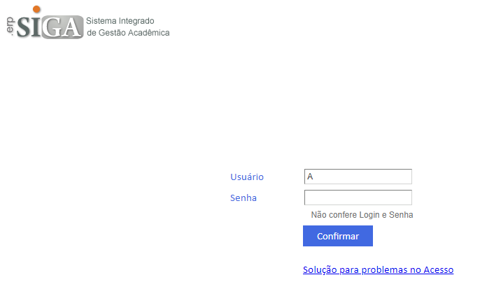
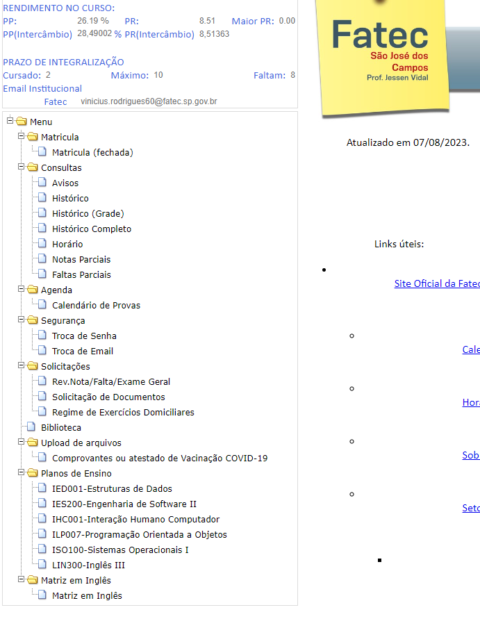
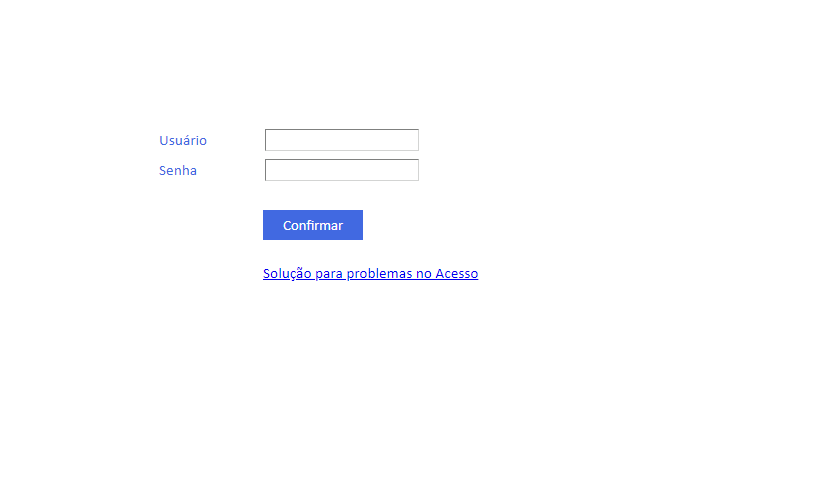
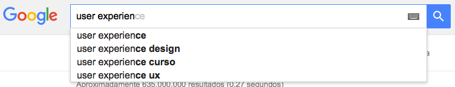

# Décima heurística - Ajuda e Documentação

### "Ofereça recursos de suporte, como documentação e ajuda online, para auxiliar os usuários a entenderem e completarem suas tarefas".

  

O siga não oferece nenhuma ajuda ou informação em relação a problemas ou dificuldades de uso para seus usuários. Dificultando o acesso, utilização e ajuda.

### Possível solução

  <ul>
    <li>Adicionar um FAQ : Frequently Asked Questions, ou Pergunta Frequentes.</li>
    <li>Melhorar o acesso a documentação de forma limpa e explícita</li>
  </ul>

 

# Nona heurística - Ajuda aos usuários a reconhecerem, diagnosticarem e recuperarem-se de erros

### "Forneça mensagens de erro claras e orientações sobre como corrigir problemas quando ocorrem".

  

O siga não oferece ajuda, porém não define certamente qual seria o erro que seria previsto, sem contar com os problemas de recuperação de senha.

### Possível solução

  <ul>
    <li>Esclarecer os possíveis erros de forma em que o usuário tenha noção.</li>
    <li>Tratar dos bugs em relação ao sistemas de rotas.</li>
  </ul>

 

# Oitava heurística - Estética e design minimalista

### "Projete uma interface que seja agradável visualmente e que não inclua elementos desnecessários".

  

O siga possui um sistema de apresentação muito poluído e mal subdividido, onde o usuário não precisa se esforçar para achar, pois está tudo na mesma tela, porém possui dificuldade de entender certas coisas.

### Possível solução

  <ul>
    <li>A construção de um menu  lateral dinâmico e mais simples.</li>
    <li>definição de outras páginas com auxílio para os usuários.</li>
  </ul>

 

# Setima heurística - Flexibilidade e eficiência de uso

### "Ofereça atalhos e opções para usuários experientes, mas mantenha a interface acessível para usuários novatos".

  

O siga não possui nenhum atalho para usuários experientes, e mesmo não ajudando os experientes, ainda assim, não consegue auxiliar os usuários novatos.

### Possível solução

  <ul>
    <li>Adição de atalhos uteís, via teclado.</li>
    <li>Definição de novas funcionalidades para usuários novatos, como um mecanismo de auxílio em cada parte complexa.</li>
  </ul>

 

# Sexta heurística - Reconhecimento ao invés de lembrança

### "Minimize a carga cognitiva do usuário, apresentando informações necessárias e eliminando a necessidade de memorização excessiva".

  

O siga não só deixa de indicar seu progresso em certos processos, como deixa de indicar onde você está atualmente na página.

### Possível solução

  <ul>
    <li>Marcar o local atual do usuário.</li>
    <li>Definir quais foram os passos dados pelo usuário para que o mesmo tenha acesso a informação.</li>
  </ul>

 

# Quinta heurística - Prevenção de erros

### "Projete para evitar erros, ou forneça maneiras fáceis de recuperar-se deles caso ocorram".

  

Aqui podemos ver como a ferramenta de pesquisa "Google" fornece muito bem a quinta heurística de Nielsen.

 

# Quarta heurística - Consistência e padrões

### "Mantenha consistência na interface, seguindo convenções e padrões de design já estabelecidos".

  

O siga é cheio de imparcialidades em relação aos padrões visuais, sempre alternando...

### Possível solução

  <ul>
    <li>Definir um único pardrão para o site.</li>
    <li>Manter tudo dentro de uma mesma pleta de cores.</li>
  </ul>

 

# Terceira heurística - Controle e liberdade do usuário

### "Forneça aos usuários a capacidade de desfazer ações e navegar facilmente, oferecendo um senso de controle sobre o sistema".

Esse será sem exemplo visual, porém com um exemplo prático. Usaremos o Twitter como parâmetro, é comum que possamos apagar um tweet se quisermos, mas não podemos editá-los, e por que? pelo simples motivo de isso poderia impactar em outras funcionalidades.

### Possível solução

 

# Segunda heurística - Relação entre o sistema e o mundo real

### "Utilize linguagem e conceitos familiares ao usuário, tornando a interface consistente com o mundo real".

  

O siga possui varios botões contra intuítivos e que não levam a lugar nenhum, e com um único requisito dessa heurística, sendo ela a relação da ccor vermelha com mensagens de erro ou de perigo.

### Possível solução

  <ul>
    <li>Melhorar a relação do hardware com o sistema em si.</li>
    <li>Revisar o que seriam esses termos familiares e implementá-los</li>
  </ul>

 

# Primeira heurística - Visibilidade do status do sistema

### "Mantenha os usuários informados sobre o que está acontecendo, fornecendo feedback adequado sobre suas ações".

  

O youtube é um exemplo clássico de como dar um feedback super intuitivo a seus usuários. Sempre fornecendo uma boa visualização de etapas.

